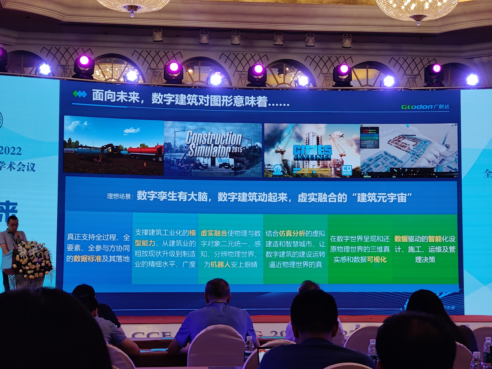
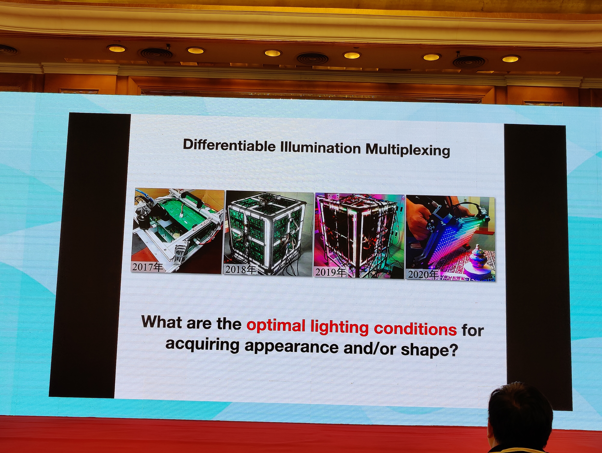
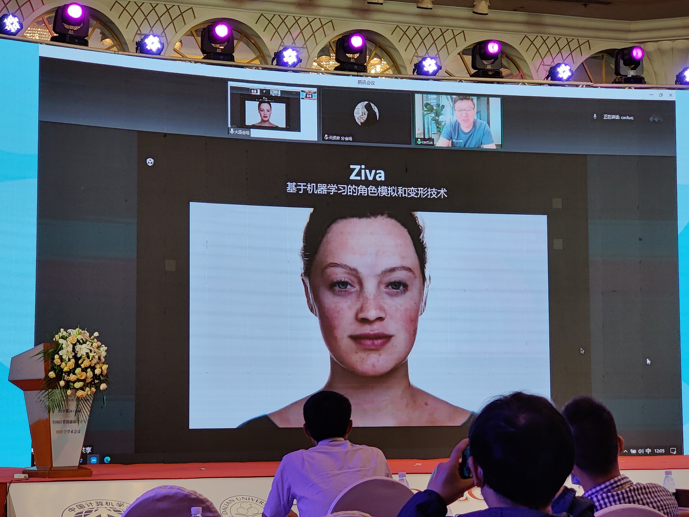
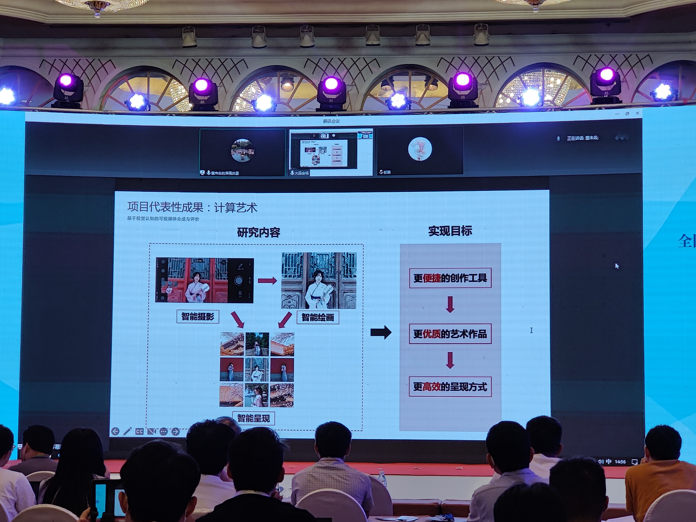
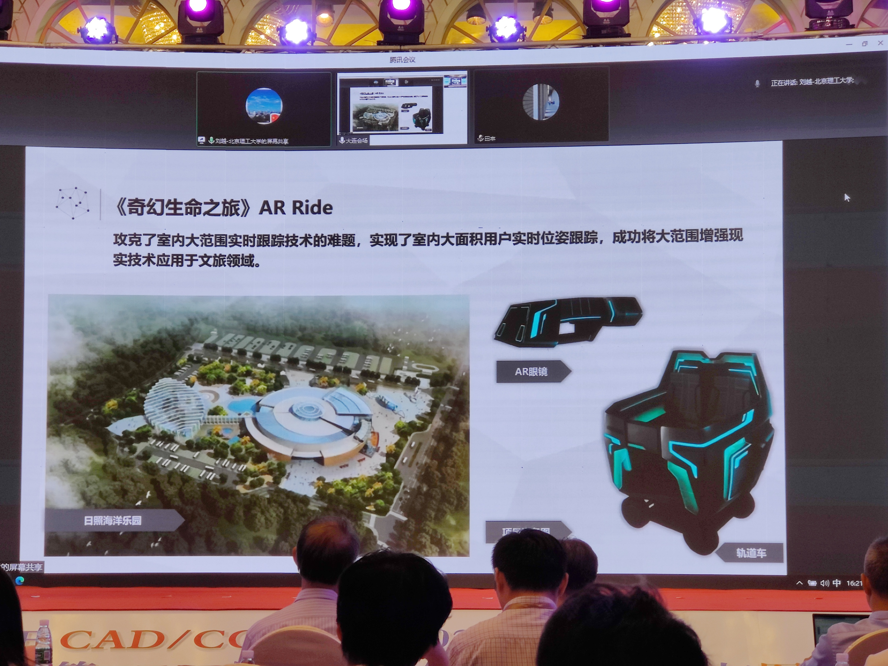
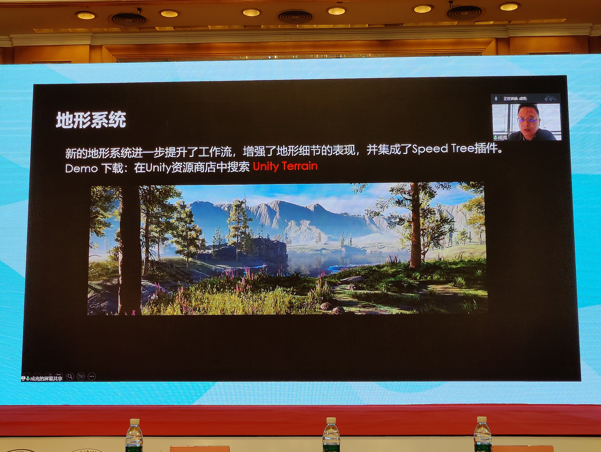
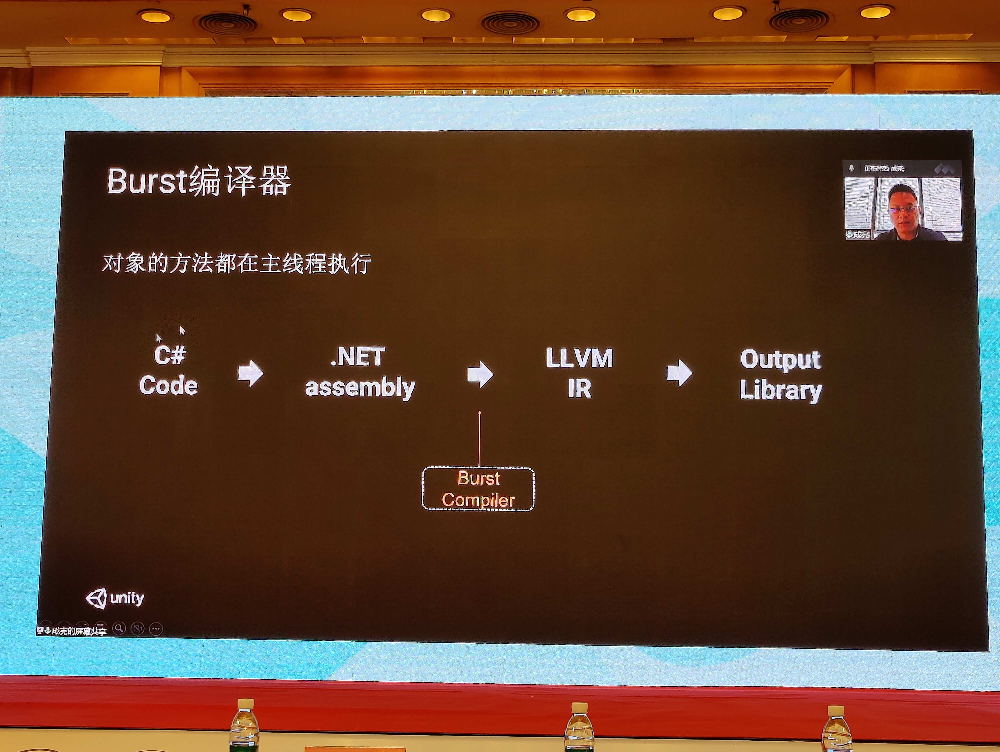
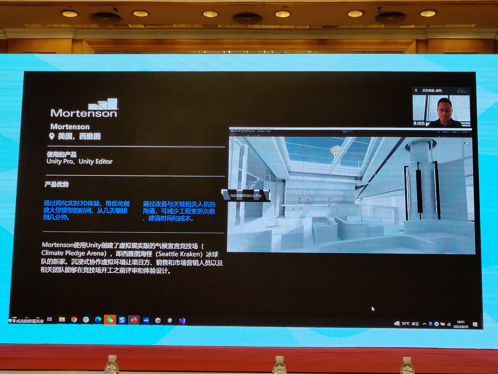
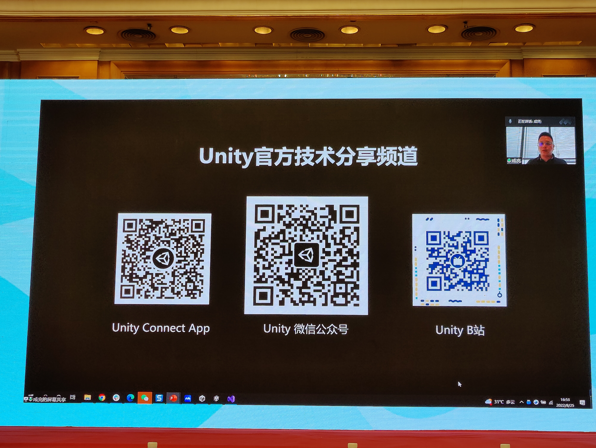

# CADCG会议记录

# 2022.08.22

## 1.从精细神经元仿真到类脑智能

### 马雷 北京大学

1.何为精细神经元仿真？

超级计算机的发展将会促进下一代可视化技术和人工智能，以及启发下一代人工智能。

目前的人工智能水平和最简单的生物脑之间还有很大差距，目前并不能帮助构建类人工智能。

当代人工智能的技术路线，类脑更倾向于从底层学习大脑的行为

实现智能的三种范式。马教授所走的是中间的路径（大脑解析+大脑模拟+大算力构建生命模型），想从更清晰的级别模拟大脑的工作方式，学习神经元的生物过程。

2.所做的研究

天演：超精微结构层次模仿脑。

通过计算模拟大脑的运作过程，将其转化为神经元之间的信息传递过程，可以通过不同层面（器官、细胞、分子等）来模拟完成不同的任务

一个经典的模型是模拟线虫的生命模型，对其的研究能揭示大脑的工作原理和神经元的工作原理。生物神经元的研究能推进深度学习模型的发展。

全球各地都有相关研究的基础设施，包括中国。

天演的主要工作：开发平台、示范模型、启发理论，并通过这样的方式促进类脑智能的发展。

近期工作：开放了面向电镜神经元的数据，并基于此做模拟和调参。

优化了大量数据下的神经元信息传递过程

3.仿真的经典模型

近期准备开放天演平台1.0，整合了之前的工作（重点在于图像学）。发布了目前世界上生物精度最高的仿真秀丽线虫。“精度最高”是指：神经系统完整、感知运动精细、身体肌肉细致、训练环境高效、生物功能重现。

今年内会将天演平台制造完成，将架构开源分享。

## 2.增强现实中的光照与处理

### 肖春霞 武汉大学

研究的内容是将物体嵌入照片中，同时嵌入的前景物体要与背景物体照片的光照保持一致

将物体嵌入照片时，需要关注照片的相机参数、嵌入虚拟物体的几何参数和材质和光照

这个领域的问题和挑战主要有：1.高精度估计出单幅图像的光照信息 2.高精度估计出场景的深度信息 3.场景材质信息的有效估计 4.实时生成光照全局一致性结果。

围绕这些问题，团队的主要贡献为：1.单幅图像的光照调整和编辑 2.虚拟物体的阴影生成 3.物体嵌入背景时的光照和谐优化 4.图像的光照估计 

从单幅图像中采用优化方法估计出相机姿态、光照信息、场景几何与材质等信息。然后编辑光照位置渲染出光照动画的效果。

背景照片的光照的估计可以用于将物体嵌入背景后，进行三维渲染，获得逼真的前背景融合效果。

主要工作总结：深度信息估计、场景光源估计、大数据集构建和视频的光照估计。

## 3.结合成像的可视媒体计算

### 张磊 北京理工大学

实现人工智能的重点是更好地利用和处理视觉信息

可视媒体的数据主要包括图像（表观）、视频（时空）和图形（几何）

可视媒体计算在过去20年可以分为三个阶段：桌面环境、网络环境和虚实融合的环境

传统的可视媒体计算模式的处理和获取过程是割裂的，直接给予视频数据来做处理。

更合理的计算模式是获取和处理的结合，将设备成像的原理、机制和环境结合到分析、编辑和合成中

针对红外视频中的光斑处理，经典的方法需要检测光斑、分割光斑、补洞最后进行视频时空优化。

但是考虑到视频的获取过程，我们可以思考光斑的来历：红外相机的遮窗中可能有灰尘或者杂质，影响视觉成像。但是光斑的位置是不会发生变化，可以进行标定处理，建立掩模。实现整个光斑抑制的过程。此方法处理快速，能实时处理。

手机设备拍摄时，上面搭载了大量的传感器可以记录运动信息。这些运动信息可以用于可视媒体计算。比如解决前背景区分问题。

传统方案包括：目标检测、目标跟踪等。

可以结合成像时的运动信息，可以推断特征点的运动是否与相机保持一致，一致就是背景，不一致就是前景。

此方法可以在手机上实时运行，可以针对更有挑战性的场景。应用：视频稳定、SLAM和图像拼接。

总结：成像原理、机制、环境蕴涵了可视媒体数据的光、时、空等信息

结合成像可以为可视媒体计算提供更多先验辅助和处理手段

结合成像可以更好地“知其所以然”，丰富感知和认识的内容

## 4.脑显微图像的三维结构重建与分析

### 陈雪锦 中国科学技术大学

微观领域越来越需要计算机图形学的帮助。本次围绕脑神经科学的研究。

用观测技术呈现大脑的完整神经元，目前能完整呈现的是果蝇的大脑。且需要大量的时间和数据量

如何利用计算机技术更好地构造全脑神经谱图？

1.对每个单个神经元做分割和成像。

2.对大量的神经元做集群的重建。

3.对集群的神经元做几何形态做分析。

面临的挑战：

深度学习方法的方法标注代价高、训练样本少、泛化能力差

自学习的方法，要处理的数据量是会暴增的，要在不同的尺度下做处理。

单个神经元的重建问题：需要将染色的神经元信号图像抽取出来（前背景分割），没有标注

方法：产生伪标签，训练三维分割网络，优化伪标签的质量。

远远超过传统方法的表现

利用神经元数据集定义形态先验，借助GAN来评价神经元片段的质量，进一步提升效果。

设计了针对块拼接处理的方法。

在微米级重建了小鼠的部分脑神经元标注。

如何分析/分类各种神经元？如何描述一个神经元的形态？

旧思路：根据分叉等，人为制定规则。

通过自学习的方法学习一种高效的形态表达。

还有基于其他类型的数据做表达学习工作。

现在可以用计算机图形学的技术来做生物的图像处理。也可以反过来，利用新的生物发现来做新的网络结构，推动发展。

# 2022.08.23

## 5.构建更真实的数字世界*

### 相芯科技

## 6.数字建筑的图形应用和挑战*

### 广联达科技公司

## 7.计算机图形学赋能工业制造*

### 未来工场科技公司

## 8.室内家居智能设计系统*

### 淘宝技术部

## 9.GPU新型管线Quad Shader介绍*

### 华为海思

## 10.AI算力加速计算机图形学*

### 思腾合力

## 11.便捷、高效、高保真数字人建模与驱动

### 张举勇 中国科学技术大学

关键词：便捷、高效、高保真

随着三维技术的发展，对真实世界做高精度的数字化是非常核心的问题。

对人做数字化

传统方法是基于相机阵列

优点：高精度建模精度、可恢复光照、材质等

缺点：受控的采集流程、昂贵的价格、复杂的制作流程

基于深度学习等：基于稀疏视角

优点：成本和便捷性得到极大提高

缺点：对于普通大众仍遥不可及

愿景：基于单目视频高保真地数字人重建

相关工作：参数化模型表示的人脸重建

优点：建模速度快，可以在移动端上实时处理

缺点：参数化模型表达能力有限

相关工作：参数化模型表示的穿衣人体重建

优点：建模速度快，可以利用先验

缺点：参数化模型表达能力有限、泛化性能不够

相关工作：单手机高精度人头重建（静态）

利用先验知识构建参数化模型构建人头，最后再优化整个人头。

进一步工作：拍摄时人头随意运动

利用了一些表情的先验

相关工作：单目自转视频的三维人体重建

结合了非刚性形变的前向并行和后向并行。基于表面渲染来做，能满足不同服饰、不同体型和戴口罩的三维重建

“我们真的需要几何模型吗？”

如果最后只是为了三维的高精度呈现，那么不一定需要几何模型。

Bleadshape：任何一个表情都可以作为一组基函数的组合

相关工作：将其拓展到NeRF上。建立一个NeRF BlendShape，不断地优化基函数即可。

拓展：跨身份的表情驱动，跨模态的驱动。

相关工作：AD-NeRF：这是一个跨模态的工作，建立了一个由语音到嘴形的映射关系。

已有落地的实际应用工作。

工作总结：基于新的表示方式、端到端的可为优化框架，数字人建模变得更便捷、高效、高保真。

后续：提升单目设备在采集光照、角度、表情和动作幅度上的鲁棒性；在移动端上建模；还要进一步提高时空信息之间的精准融合。

## 12.可微分视觉信息采集建模

### 吴鸿智 浙江大学

什么是数字视觉信息？

传统的卷积神经网络真的是端到端的吗？

不是，在车的照片之前还有物理的车

更完整的流程包括两个部分：物理上的采集和计算上的处理

但是物理上的采集的流程通常和后面的计算的处理是脱节的。

其实相机并不是为“机器”所设计的，而是给“人”设计的，所以通常要有很多的像素或者其他成像要求。这通常与我们实际最后要做的工作（比如分类）有巨大的鸿沟，DL的主要工作（pooling、down-sampling等）就是填补两者之间的巨大鸿沟。

直接为机器发明一个相机，形成一个联合的采集系统。优点：可以联合优化采集和计算过程；目标驱动的（软硬件）优化；实现硬件软件的跨领域优化；神经网络不是最重要的，最重要的是可微分（可优化）。

关键问题：打光。

为研究物体的几何、材质，同时拍出高质量、少数量的照片，要如何打光？

“全栈式的能力”：研究这项系统需要运用各项能力

相关工作：单视角下的几何材质扫描。

数字化的控制灯光进行打光。

其率先提出了可微分采集建模的框架。其本质上是一个编解码问题，从物理上学习编码，从计算上学习解码。把整个采集和重建全部映射到神经网络上（类似智能硬件的概念），实现从硬件端到软件端的全自动优化，实现高效高质量。

做了一个更大的设备，包含转台。解决了很多底层的硬件问题，光采样密度极高。

相关工作：利用多视角相机之间的关系，减少拍摄图片的数量（768减少到96）

相关工作：能否继续利用这些材质上的信息来构建几何重建的信息。

相关工作：做了一个更轻便的手持扫描仪实现非结构化的采集。

非结构化材质采集的本质：在非结构化的高维点云上的几何学习。

还有一些数据库方面的工作（在投）。

## 13.基于单幅图像的逆向渲染技术

### 过洁 南京大学

一张图片中有哪些信息？

几何形状、材质外观、光照环境

能否让机器由一张图片来推理相关的信息？

传统的方法对于普通大众是可望而不可及的。

从最朴素的单张图片开始分析问题，解决以上问题。

相关工作：聚焦于材质和光照（该团队几何方面做得少）

材质的捕捉：引入深度学习来捕捉BRDF信息

图像的信息量很多，但针对这个问题其冗余性非常高。利用神经网络来做材质空间的压缩，构建材质高维信号的低维隐空间（大约10维就够）。

SVBRDF：更大维度的重建问题

目标：基于单张随机的图片、能很好地解藕图片中的材质、能够处理高光（重要问题，单张图片很易受高光光斑影响，课题组设计了一个双流网络来分析光斑的数据，排除光斑的影响，提出了“高光敏感”卷积形式）、快速处理

相关工作：进一步提升分辨率（做到4K，其实也可以做到8K）。

高分辨率的问题：会暴显存

利用了分块划分预测的思路，同时寻找不同块之间的关联性，解决分块后的全体特征保留问题。

相关工作：室外光照的判断

对室外的环境光做了特殊的表示，用神经网络对环境光做压缩。将环境光中的太阳光和天空的光分解开，分别处理。

可以判断环境处于阴天还是晴天，并分别细化处理，优化压缩处理的过程。

室内光环境非常复杂，如何表示室内光？

球面高斯表达室内环境光（此项工作比较受欢迎）。

通过神经网络建立球面和笛卡尔的结构化信息来描述光照。

进一步工作：基于多幅图来做工作

# 2022.08.24

## 14.虚拟数字人制作技术*

### Unity中国

## 15.增强现实与智能机器人*

### 秦学英 山东大学

## 16.数据驱动的三维内容生成

### 许威威 浙江大学

背景任务：创建真实世界的3D数字孪生世界（多模态虚拟环境），需要考虑世界的多样化、各种物体类型、动态化。

应用：工业、运维、娱乐。

需要人们从方程的角度来描述世界。

数据驱动的3D内容生成发展非常迅速，用各种模型及其参数借助数据驱动来构建3D内容。

相关工作：SIM2REAL：自动驾驶应用：基于自动驾驶的数据合成3D的街景数据。

挑战：1.车辆具有影子，需要消去；2.车辆有较大的自运动，影响了光流数据。

研究团队通过神经网络的设计解决了对应的问题，获得了非常好的结果。

相关工作：利用神经网络优化室内场景渲染的效果

贡献：1.数据很多时，对神经网络训练是一个挑战；研究团队使用了分块式训练，分解了训练过程，使每块神经网络可以独立地训练。

2.利用神经网络对光照表达进行了分解。

3.合在一起，实现了快速渲染地算法。

对高光场景：上面的光源可以视为真实的光源，而下面的光源则视为虚拟的光源。研究团队利用神经网络去表达虚拟光源替代真实光源，将高频信号转化为低频信号，大大提升训练效率。

利用场景的不同的group和tile来模拟高光的移动，加速计算，提高了虚拟环境的构建效率。

结果演示，算法能够获取到很好的效果。

## 17.基于视觉认知的可视媒体合成与评价

### 董未名 中科院自动化所

介绍可视媒体：包括图像、视频、三维模型。

可视媒体的获取：实景拍摄和自主创作。

但是实景拍摄的技术要求较高，所以可视媒体合成逐步兴起，成为获取可视媒体内容的重要途径。

可视媒体合成：针对输入的可视媒体，计算输出新的可视媒体。

可视媒体的评价可以帮助人来不断完善可视媒体的内容，它影响了可视媒体的创作和推荐。

人工智能为可视媒体的内容创作技术发展带来了机遇。为可视媒体内容创作的智能化发展提供了坚实基础。

项目代表成果展示：在计算技术的框架下，以人工智能为基础，开展智能摄影、智能绘画、智能呈现的技术研究。让普通大众更好的进行艺术创作和欣赏艺术作品。打破创作者的自身专业技能的限制，创作更好的艺术作品，以更高效的方式呈现给其他人。

智能摄影（图像美学评价）：拍摄高质量的照片需要创作者掌握一定的摄影知识，同时被拍摄者也要有好的姿势，这对没有专业知识的普通人来说比较困难。研究团队针对此需求在智能摄影领域开展了很多关键技术研究，帮助大众方便快捷地进行摄影作品创作。

关键点：摄影作品的美观程度。

科学问题：视觉审美的计算机理。

挑战：摄影作品的量化评价困难。

以摄影网站上的大量作品作为训练数据，训练量化模型，让机器具备自动判断照片审美质量的能力。比如构图是否优美等。

智能摄影（人像摄影自动姿势推荐和构图优化）：基于评价模型，融合场景语义特征、相机姿势、人体特征等多模态信息来进行姿势的推荐和构图引导。引导模特做出符合美学的姿势。

推出了APP：AI拍，帮助大众进行摄影创作，对拍照时的模特姿态和摄影构图做引导。

智能绘画（任意图像风格化）：将照片变成绘画。

科学问题：绘画风格的表示机理。

挑战：绘画风格多样，风格特征表示难。

提出了任意图像风格化的系列方法，通过任意输入的自然图像和绘画图像来实时生成新的绘画图像。

可以生成高质量的绘画图像结果，生成时间短。还可以将多种风格融合的处理结果。

智能绘画（多模态引导绘画生成）：通过将生成模型与图文预训练模型相结合，实现文字引导的绘画图像生成。

智能绘画（视频风格化）：基于特征点对齐的视频风格化方法。通过将输入和输出视频帧之间的内容和风格特征对齐，生成流畅的绘画风格视频。

智能呈现：在社交平台上呈现多张图片的方法（九宫格）。

提出内容相关的图像正方形优化方法；提出基于视觉认知的“信息平衡”指标对照片集呈现质量进行评价，优化画面各区域之间的照片内容、色调和物体大小之间的视觉平衡。

实现了高效美观的视觉呈现。

总结：提出了摄影和绘画艺术智能创作系列理论和关键技术。

提供了面向普通大众的方便快捷的艺术创作和分享工具。

推动了人工智能在可视媒体生成和评价方面的创新发展。

## 18.虚拟现实技术及其在文化娱乐产业中的应用

### 刘越 北京理工大学

介绍了虚拟现实的技术定义

其关键技术包括：真实环境感知和理解、虚拟场景建模与绘制、逼真呈现和自然交互、应用系统开发与集成

传统的虚拟现实技术依然有巨大的潜力和市场活力，在各个领域有着广泛的应用。

个人虚拟现实应用前景无限，也有大量的应用。比如Pokeman GO游戏。

可穿戴式的设备将成为下一个信息时代的爆发点

人机交互技术的后续市场发展也是无可限量

以及体验式消费时代为虚拟现实文娱应用提供了无限可能

虚拟现实文娱应用的挑战：虚拟现实晕动症

解决方案：保持前庭和视觉运动线索保持一致。比如：自由漫步、同步载具

虚拟现实应用项目：《寻龙诀》

虚拟现实应用项目：室外大范围混合现实漫游系统

虚拟现实应用项目：《集结号》VR Ride

虚拟现实应用项目：《奇幻生命之旅》AR Ride

在5G+AI时代的背景下，VR/AR有希望成为杀手级的应用

## 19.智能时代的人机交互

### 田丰 中科院软件所

人机交互的发展历程：批处理、命令行、图形界面、自然交互

人机交互决定了人类使用信息技术的模式、人机交互的变革推动了信息技术的广泛普及。

以前的人机交互是以机器为中心的，需要人把交互任务分解为机器规定的操作。交互信息是离散的、精确的、单通道的。

现在的人机交互要转变到以人为中心，要做到感人（人的自然交互行为非精确、连续、多通道）、知人（计算设备作为认知主体，理解人的意图状态）、拟人（符合用户的认知特点的输出反馈）

相关工作：1.智能化的RFID，基于一种微流控技术，在标签里加入了一滴液体，由液体的状态感知周围的状态。

相关工作：2.基于微流控技术的多种电极与金属的感知

相关工作：3.基于人EMG（肌肉电）信号来对人的日常物体进行感知。

相关工作：4.设计了一种可穿戴的指环，可以判断手势。

相关工作：5.设计了一种感知牙齿动作的交互技术

相关工作：6.用户意图理解技术

相关工作：7.虚拟的湿度知觉生成和控制技术。通过温度、压力和摩擦力的刺激来生成虚拟的湿度感受。

相关工作：8.基于化学物刺激的痛觉生成和控制。利用辣椒素注射来生成疼痛的刺激，这个过程是无害的。

相关工作：9.基于微流体结构的柔性反馈技术。

一项应用：多模态自然人机交互神经系统疾病辅助诊断工具

与协和医院合作，经过一系列的交互测试，对病人进行神经学方面的辅助诊断。有很好的应用与成就。

思考：人机交互和人工智能的关系：人机交互领域的专家Grudin认为：人工智能和人机交互是交替沉浮的，人工智能低谷时，是人机交互的大发展时期。

但是研究团队认为：现在人工智能和人机交互是协同共进的，其发展方向是人类智能与机器智能的有机协同。

# 2022.08.25

## 20.基于结构的场景重建和新视角生成

### 高盛华 上海科技大学

经典三维场景重建：通过图像的匹配关系，找到三维空间点在不同图像上的位置。通过求解优化问题，找出物体的位置。

本质上的是优化问题。

经典的方法在实际应用中有很多的问题：1.同一个点在图像中出现多次（重复纹理）。2.无纹理区域。3.动态场景。

某团队的工作：基于人的感知是非常重要的，人对于线条、面片的几何感知非常敏感。如果能够解决几何感知，那么就能帮助进行三维重建。

研究团队的工作：基于几何结构关系的三维重建

几何结构学习：线、面的检测、房间布局的检测

这些学习可以帮助克服经典方法中的一系列挑战。

相关工作：基于面的三维场景重建工作。

把三维重建工作定义为面的检测发现和面的法向量估计，极大的提升了结果

相关工作：基于360图像的三维结构重建

传统方法会有结构没有很好保持的问题。研究团队的方法：首先找出房间的几何结构、布局，基于大的结构平面，在用场景估计几何结构和用深度估计的几何结构保持一致的约束。保持深度信息有几何结构信息。

相关工作：基于秩监督的室内场景深度估计。其基于自动驾驶中的运动估计和深度估计方法。

研究团队提出了保持场景中的几何结构来完善室内场景的重建。

相关工作：场景的新视角生成。

基于360图像，给定场景，通过其他视角的图片来生成新视角下的图像。此项工作可以很好的应用到VR上去。

构建了一个室内场景的数据集。

基于NeRF和曼哈顿假设，使估计出来的场景更加的平整。

总结：通过场景中的几何结构来进行深度估计和三维重建，并且可以应用到多个领域上去（VR、AR等）。

## 21.现代渲染引擎技术概述*

### 三维家

## 22.元宇宙开发*

### Unity中国

